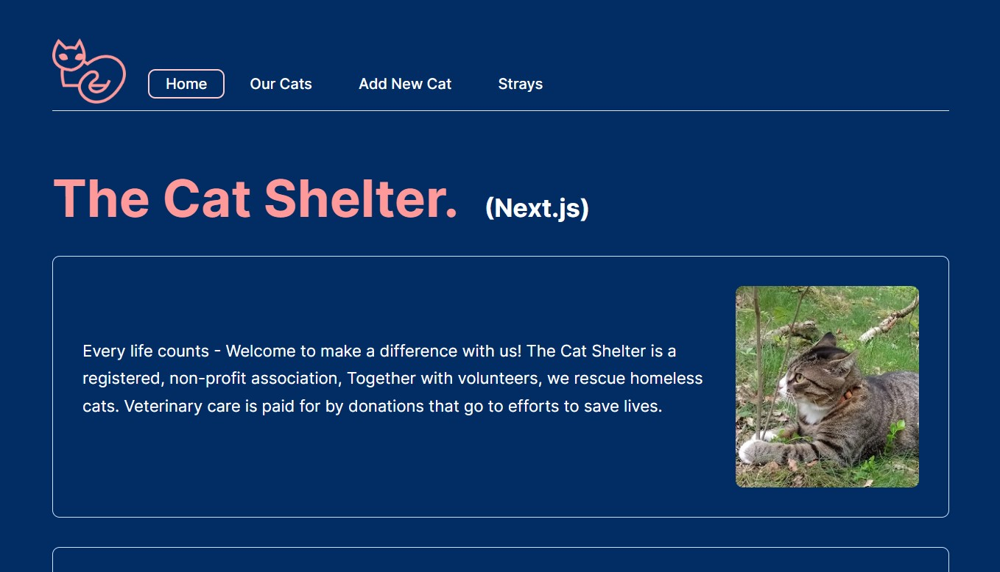

# the Cat Shelter - Next.js

## React course-Lab2

Next.js project.  
Fetching and updating DB data with JSON server. 
A Cat Shelter Home page where you can see a list of the current cats in the shelter. 
You can also add cats and see details of each cat.  
There is also a dumm list of stray cats in line for the Shelter.
Enjoy!

## Installation

To clone

`https://github.com/karinlj/next.js-cat-shelter.git`

To install

`cd next.js-cat-shelter`

`npm install`

To run

First run `json-server --watch --port 4000 ./_data/db.json`

then open a new terminal and run `npm run dev`

To test

Open a new terminal and run `npm run test`

## Built With

- Next.js
- React.js
- JSON server
- SCSS
- Jest

## Author

- **Karin Ljunggren** - [karinlj](https://github.com/karinlj)

## License

This project is licensed under the MIT License - see the [LICENSE.md](LICENSE.md) file for details
